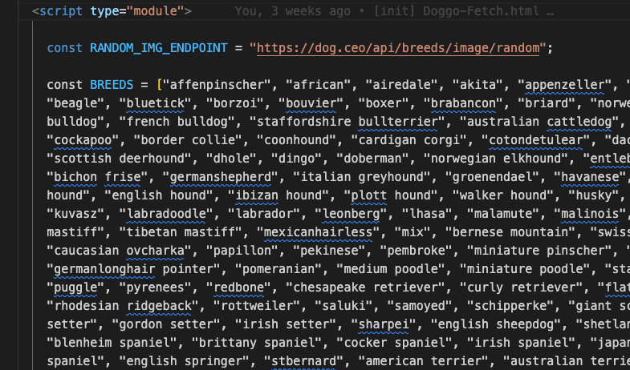
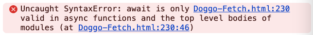
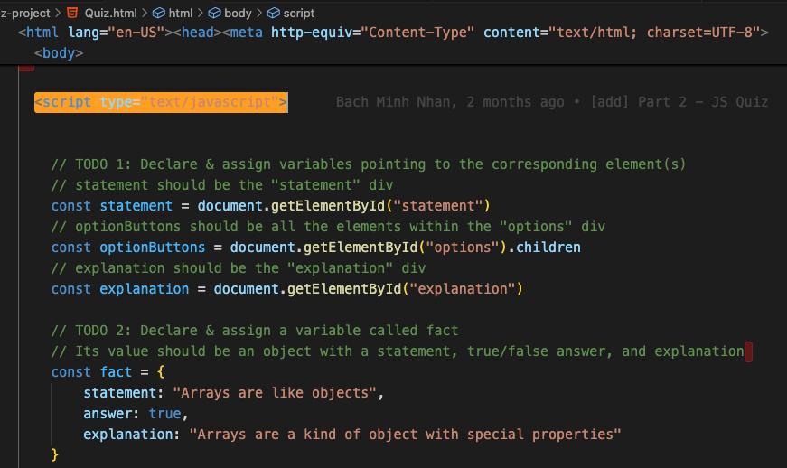
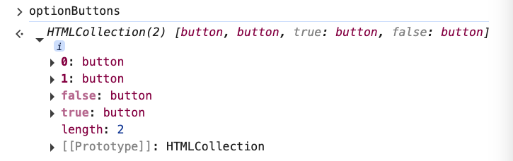
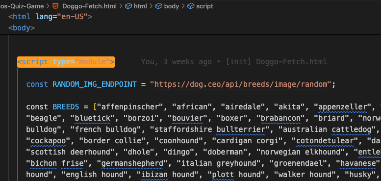
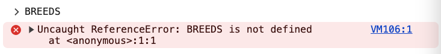
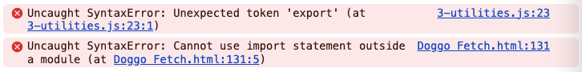

# 1. Modules

URL: [https://frontendmasters.com/courses/javascript-first-steps/modules/](https://frontendmasters.com/courses/javascript-first-steps/modules/)

MDN: [https://developer.mozilla.org/en-US/docs/Web/JavaScript/Guide/Modules](https://developer.mozilla.org/en-US/docs/Web/JavaScript/Guide/Modules)

- **Modules let us split big codebases across multiple files**
    
    
    
    Example: Doggo Fetch Project
    
    **Modules** let hugely complex JavaScript project being written with huge teams split up into different places, with multiple files in the world so that it becomes a little bit easier to work with.
    

- The differences between **Module Style JavaScript** and **Regular JavaScript**
    - Top-level **await**
        
        At the end of our doggo program we had to use **await** *outside* of a function, which is *not* usually possible in JS
        
        ```jsx
        // TODO 5
        // Asynchronously call the loadQuizData() function,     
        // Then call renderQuiz() with the returned imageUrl, correctAnswer, and choices 
        const [imageUrl, correctAnswer, choices] = await loadQuizData();
        renderQuiz(imageUrl, correctAnswer, choices);
        ```
        
        The reason it works is because we are using `type=”module”`  for the `<script>` tag
        
        ```jsx
        <script type="module">
        	// ....
        </script>
        ```
        
        
        
        Without the specified **type**, JavaScript will show the error
        
        
        
        `Uncaught SyntaxError: await is only valid in async functions and the top level bodies of modules (at Doggo-Fetch.html:230:46)` 
        
    - Module scope
        
        > Modules create their own scope
        > 
        - Variables declared within the **regular JavaScript** scope ARE still accessible from the outside
            
            
            
            
            
            **optionButtons** is accessible from the global scope.
            
        - Variables declared within the **module JavaScript** scope are NOT accessible from the outside.
            
            
            
            
            
            **BREEDS** is NOT accessible from the global scope, it is local to the scope of the module.
            
    - import && export
        - [export](https://developer.mozilla.org/en-US/docs/Web/JavaScript/Reference/Statements/export) - lets us expose variables from our module's scope to the outside world
            
            
            
            ```jsx
            // myModule.js
            const veryUsefulFunction = () => "I came from a module";
            export { veryUsefulFunction };
            ```
            
        - [import](https://developer.mozilla.org/en-US/docs/Web/JavaScript/Reference/Statements/import) - lets us use an exposed variable from another module
            
            ```jsx
            // otherModule.js
            import { veryUsefulFunction } from './myModule.js'
            
            veryUsefulFunction();
            ```
            
        
        > Only those values that are **exported** are *exposed* to the **global** scope. Those that are **NOT exported** will be only *local* to the **module** scope
        > 
        
        Attention:
        
        > **import** and **export** statements can ONLY be used INSIDE a **module**
        > 
        
        The `<script>` MUST have `type=”module”`  so that you can use **import** and **export**
        
        Otherwise, JavaScript will throw errors
        
        
        
    - Loading module
        
        Due to browser security policies about how one file is able to load in information from another file, you must open the file on a hosting interweb in order to load another module. Loading modules will not work if you run the files locally.
        
        JavaScript will throw this error if you run the files on local
        
        `GET [http://127.0.0.1:5500/3-utilities.js](http://127.0.0.1:5500/3-utilities.js) net::ERR_ABORTED 404 (Not Found)`